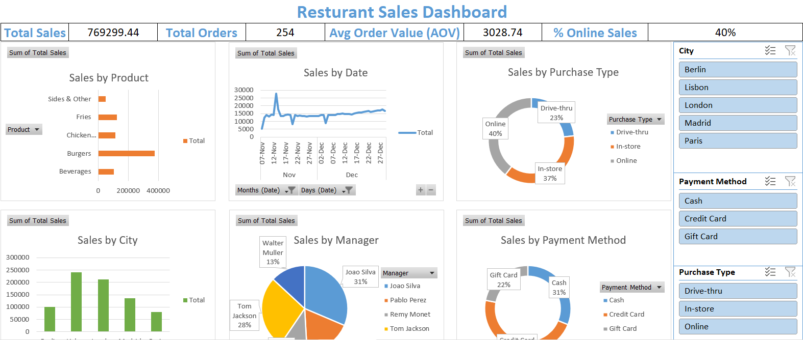
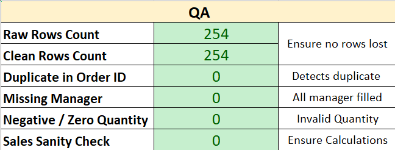
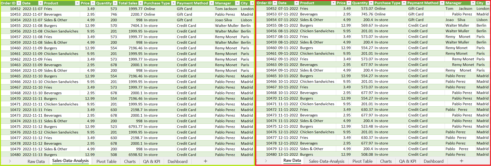

## 🚀 How to Use
1. Clone this repo.
2. Open `workbook/Restaurant_Sales_Report.xlsx`.
3. Enable content & macros.
4. Run **Refresh & Export** macro to reload data.
5. Explore dashboard with slicers and timeline.

---

## 📸 Screenshots
### Dashboard

### QA Sheet

### Raw vs Cleaned Data

---

## 🎯 Key Takeaways
- Reduced manual cleaning by automating with **Power Query**.
- Ensured **data integrity** with QA formulas.
- Delivered an **easy-to-use dashboard** for management.
- Demonstrates ability to translate messy business data into **actionable insights**.
